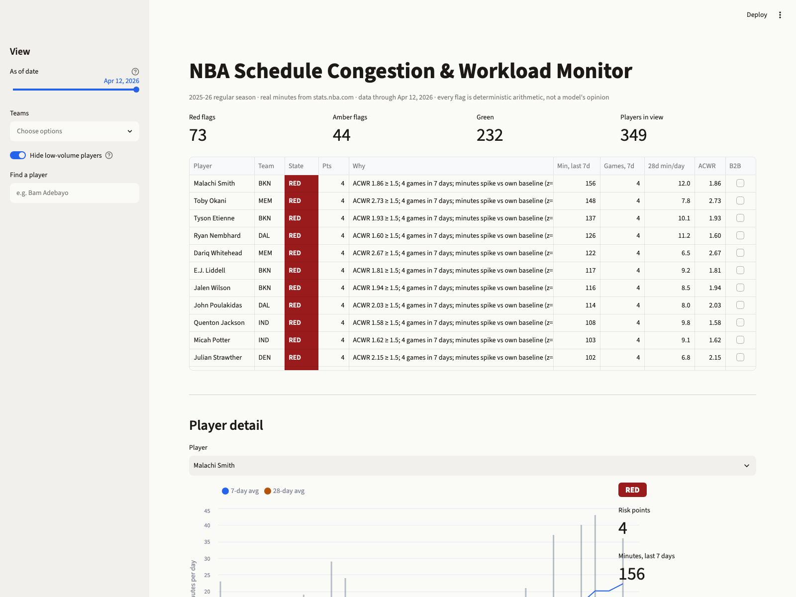
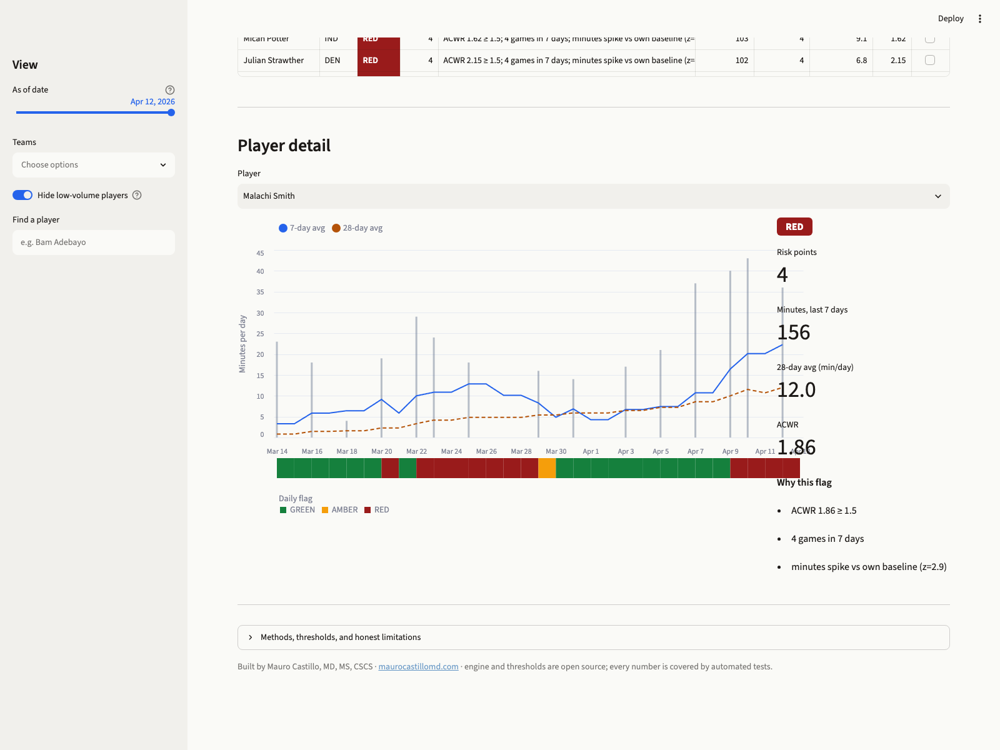

# NBA Schedule Congestion & Workload Monitor

A live answer to one question every basketball performance staff asks weekly:
**which players are entering a high-risk workload window right now?**

Real NBA box-score minutes go through a deterministic trailing-window engine.
The engine flags schedule congestion, minute spikes against each player's own
baseline, and return-from-layoff ramp-ups. Every number is arithmetic on public
data, covered by automated tests. No model writes a number.





## What it computes

For every player, every day of the season:

| Metric | Definition |
|---|---|
| Acute load | trailing 7-day minutes |
| Chronic load | trailing 28-day minutes, averaged per day (fixed denominator, off days count as zero) |
| ACWR | (acute / 7) / chronic — not rated when the chronic base is under 5 min/day |
| Schedule density | games in the last 7 days; back-to-back detection |
| Minutes spike | z-score of each game vs the player's own prior 28 days of games (minimum 3 prior games) |

Flags are a transparent point system (thresholds in
[`nba_workload/config.py`](nba_workload/config.py)):

- ACWR ≥ 1.50 **+2** · ACWR ≥ 1.30 **+1**
- Low-chronic ramp-up (60+ min in a week on an unrated chronic base, e.g. returning from a layoff) **+2**
- 4+ games in 7 days **+1** · back-to-back **+1** · minutes spike z ≥ 1.5 in the last 7 days **+1**

**RED ≥ 3 · AMBER = 2 · GREEN otherwise.** The "as of" slider replays any date
of the season using only information available on that date (trailing windows,
no leakage).

## Run it

```bash
python3 -m venv .venv && .venv/bin/pip install -r requirements.txt
.venv/bin/python -m pytest            # 17 tests on the engine
.venv/bin/streamlit run app.py
```

The repo ships with a data snapshot (`data/player_game_logs.parquet`, 2025-26
regular season, 26,568 player-game rows). To refresh from the NBA stats API:

```bash
.venv/bin/python scripts/refresh_data.py 2025-26
```

Run the refresh from a residential connection — stats.nba.com blocks most
cloud IPs, which is exactly why the app reads a committed snapshot instead of
calling the API at runtime.

## Architecture

```
stats.nba.com ──(nba_api, one call per season)──> data/*.parquet   [refresh script, local]
data/*.parquet ──> nba_workload/engine.py ──> daily player grid    [pure pandas, tested]
daily grid ──> app.py (Streamlit + Altair)                         [display only]
```

- `nba_workload/engine.py` — the entire model. Pure functions, no I/O.
- `nba_workload/config.py` — every threshold, one page.
- `tests/` — the contract: windows, ACWR, z-scores, flag rules, leak-free as-of slicing.
- `app.py` — league table, player detail chart, daily flag strip, methods page.

## Honest limitations

Public minutes are a proxy, not a load measurement: no practice load, no
travel, no positional demands, no force-plate or GPS data. ACWR is debated in
the sports-science literature; here it is one input among several, never a
verdict. This is a monitoring lens that starts conversations. It is not
medical advice and not an injury prediction model.

## Roadmap (deliberately not built yet)

- G League data (same engine, different league ID)
- Playoff games in the chronic window
- Travel distance and time-zone crossings
- Nightly in-season refresh via a scheduled local job

---

Built end-to-end by **Mauro Castillo, MD, MS, CSCS** —
[maurocastillomd.com](https://maurocastillomd.com)
